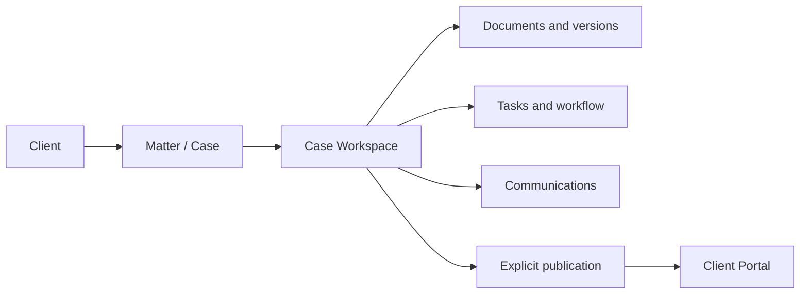
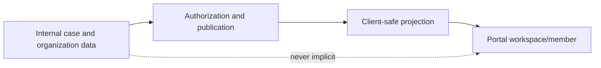
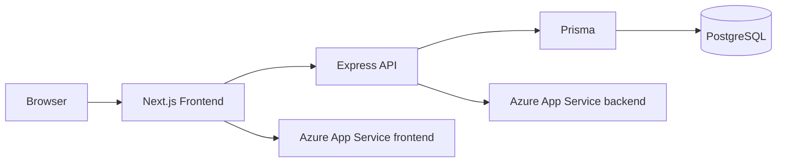
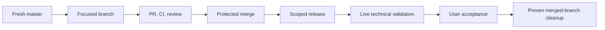

# Adminiculum

Adminiculum is a legal operations platform for law firms. It keeps the client,
matter, and operational work around legal work connected: intake, routing,
missing information, responsibilities, deadlines, documents, review,
communication, publication, and organizational context.

It supports lawyers; it does not practise law autonomously or replace legal
judgment. Lawyers remain responsible for strategy, drafting, negotiation,
advice, approvals, and consequential decisions.

The repository contains `Frontend/` (Next.js App Router) and `Backend/`
(Express, TypeScript, Prisma). Development defaults are frontend port `3000`
and backend port `3001`. No `LICENSE` file is present; public visibility is not
a reuse license.

## Product vision

Adminiculum is being built as a legal operating system: the operational layer
around legal work should make context, ownership, missing information, risk,
next action, and decision required visible without displacing professional
responsibility.

The central UX principle is **complexity in the background, clarity in the
foreground**. Screens should be clean, low-noise, hierarchical, and
task-oriented. Compliance, workflow, and legal-operations machinery should
usually appear as context, status, risk, next action, or decision required.

## Product principles

- Preserve legal context and the relationship between a client, matter,
  document, decision, and history.
- Keep one canonical source of truth instead of parallel shadow models.
- Operate from the client and tenant boundary outward.
- Keep internal data and client-safe publication explicitly separate.
- Preserve traceability, human authority, and least exposure.
- Word remains the primary document editor where that contract is current;
  Adminiculum is not intended to become a weak browser Word clone.

## Platform map



Organizational clients add groups, people, responsibilities, corporate
operation, growth context, and compliance views. Internal structures are not
automatically client-visible.

### Canonical terminology

The repository uses these terms deliberately:

- **Client** is the legal relationship and tenant-scoped business context.
- **Client Dossier** is the client-level operational overview.
- **Client Control Center** is the dossier's module and action surface.
- **Case** and **matter** refer to the legal work record.
- **Case Workspace** is the operational matter surface.
- **Document** is the document record; **DocumentVersion** is a retained file
  version and its metadata.
- **Client Portal** is the explicit external workspace and publication boundary.
- **Organization Group** is a canonical organizational unit.
- **Organization Person** is an internal directory and responsibility record.
- **Responsibility** describes a typed organizational or operational role.
- **Task** is assigned operational work; **Workflow** coordinates selected
  transitions and dependencies.
- **Publication** is an explicit client-facing release of safe material.
- **Grow with us** is the organization-facing progression context.
- **Compliance** is the current findings/proposals/next-step context.
- **Work Package** and **Case Type** describe workflow foundations where the
  current module supports them.

The Hungarian UI label `ügyátvezető` should be preserved when it is the
canonical label for a workflow role; translations should explain rather than
silently rename the domain concept.

## Client management and the dossier

Client management is live. The application provides a client list, client-
scoped navigation, profile/context data, client colors and identity, related
cases, documents, communications, house style, and operational actions.

The Client Dossier is the client-level overview. Its Client Control Center
currently exposes:

1. Open cases (`Nyitott ügyek`), with a numeric KPI only when the case set is
   complete and authoritative.
2. Communications (`Kommunikációk`).
3. Client Portal (`Ügyfélportál`).
4. Organization (`Szervezeti felépítés`) for active organization capability.
5. Grow with us for active organization capability.
6. Compliance for active organization capability.

The dossier also preserves the hero context and `Új ügy`/`Haladó` actions,
Quick Actions, House Style, connected cases, documents, and communications.
The organization area is a compact `ClientOrganizationPreview`; the full
workspace remains at `/clients/[clientId]/szervezet`. Modules deep-link into
canonical detailed workspaces instead of duplicating their control surfaces.

Individual, `ORGANIZATION`, and `CASE_RELAY` modes are distinguished only where
the active contracts support that distinction.

## Cases and Case Workspace

A Case (or matter) is the legal work record. Current routes and services support
case lists, client-scoped cases, status, ownership/responsibility, detail and
workspace context, related documents, communications, tasks, deadlines, and
attention/action views where the module applies.

The Case Workspace composes those canonical services. It is not a second case
database. Its sections vary with case state, but the current architecture links
the case to documents and versions, tasks and workflow, responsibility,
communications, and explicit client publication. Work Package and Case Type
foundations exist for selected flows; a general builder remains evolving
direction rather than a universal current feature.

## Documents and Document Workspace

Documents have metadata and `DocumentVersion` history. They may be linked to a
case, task, person, contract, or other legal work context. Review transitions,
structured comparison, annotations, security classification, and delivery are
implemented in parts of the current system.

The document workspace is for viewing, version context, comparison where
implemented, review, decisions, approvals, delivery, and explanation or
publication. Word remains the primary editing environment where that contract
is current. Do not describe Adminiculum as a browser-based Word replacement.

## Communications

Communications support client and matter association, scoped lists and filters,
pagination, and dossier summaries. Internal and external visibility are
separate concerns. The repository contains provider fields and Outlook-related
work, but Outlook production integration must not be claimed unless an active
route and deployment contract prove it.

## Client Portal

The portal is an explicit external boundary. Current concepts include portal
workspaces, portal identities, invitations, memberships, membership requests,
organization membership, client requests/intake, publications, matter
publication, and safe summary projections.



An `OrganizationPerson` is not automatically a portal identity. An internal
contact email does not create membership. Individual, organization, and
`CASE_RELAY` portal modes are supported where their current contracts apply.

## Organizational clients

Organizations need more than a contact record. `ClientOrganizationGroup` is
the canonical unit model and `OrganizationPerson` is the internal directory
record. Current relationships include `parentGroupId`, `organizationGroupId`,
`managerPersonId`, and `deputyPersonId`. Services enforce same-client links,
self-link prevention, hierarchy-cycle prevention, portal-membership isolation,
responsibilities, and owner links.

People can own contracts, obligations, and development initiatives. Responsibility
gaps identify selected unowned or inactive-owner situations. HR-confidential
document links have a separate role gate.

### Organization workspace

The current `/clients/[clientId]/szervezet` workspace supports hierarchy,
people, person detail, responsibilities, manager/deputy context, portal-access
concepts, and responsibility gaps. The dossier preview is intentionally
compact and does not create a second hierarchy.

### In development: visual Organization Editor

The product direction includes executive hierarchy, units, employee cards,
editable structure, person contact information, moving people and units, and
later drag/drop. This visual redesign is not claimed as live current UI. The
data/API foundation and the visual editor are separate slices.

## Grow with us and Compliance

Grow with us is an organization-facing entry point into corporate operation and
next steps. In the current dashboard it is a navigation card; demo fixture
values such as `DEMO_KFT_COMPANY_EMPLOYEE_COUNT` are not generic production
intelligence.

Compliance views expose relevant areas, findings, proposals, and operational
next-step context where implemented. This is not a claim of autonomous legal
or regulatory advice. Future rule evaluation and richer evidence workflows are
possible direction. The removed Tax Engine is not an active roadmap item.

## Responsibilities, tasks, workflows, and agenda

Responsibilities are typed organization-person assignments. Ownership links
connect people to contracts, obligations, and initiatives. Tasks support
assignments, statuses, deadlines, lifecycle transitions, review/submission
concepts, and case/document links where applicable. Workflow templates and
instances exist for selected flows. Attention logic surfaces work requiring
action.

Agenda and deadline convergence exists for case operations. Do not describe the
repository as a complete shared team-calendar or event-creation product merely
because date fields exist.

## AI, anonymization, and privacy

The repository contains prompt handoff, anonymization, document-analysis,
AI-cache/read-model, and structured-assistance foundations in selected modules.
These are assistive capabilities. They do not publish legal conclusions without
human control.

Privacy relies on authenticated internal actors, tenant/client scoping,
customer-safe projections, explicit publication, portal boundaries, and
confidential-document handling. Internal users and portal identities are
different security concepts.

## Time, billing, reporting, and search

Time attribution, timesheet, and reporting foundations exist and are evolving.
Do not claim production-complete automatic billing or invoicing without an
active route, service, and release contract. Operational navigation supports
client, case, status, workspace, communication, and pagination filters within
the authorized domain.

## Authentication and authorization

The frontend uses authenticated application providers. The backend uses
authenticated internal actors, role checks, service-level authorization, and
client-scoped access checks. Portal identities and memberships are distinct
from internal users. This README intentionally publishes no secrets, tokens,
tenant IDs, or exploitable operational detail.

## Data model overview

- Core legal operations: `Client`, `Case`, users, matter status and ownership.
- Client operations: profile, colors, house style, workspace context.
- Documents: `Document`, `DocumentVersion`, review, comparison, annotations,
  classifications, and work-context links.
- Portal/publication: workspace, identity, membership, invitations, requests,
  publications, and safe projections.
- Organization: `ClientOrganizationGroup`, `OrganizationPerson`,
  responsibilities, manager/deputy relationships, and ownership.
- Workflow/tasks: task lifecycle, workflow templates/instances, submissions,
  attention, deadlines, and work-package context.
- Compliance, communications, security, and audit: findings/proposals,
  communication records, authorization, upload security, and migration history.

## Frontend and backend architecture

`Frontend/` is a Next.js App Router, React, and TypeScript application. Routes
live under `src/app/`, shared UI under `src/components/`, and typed API
wrappers under `src/lib/`. `Frontend/tests/` contains structural and behavioral
contracts.

`Backend/` is an Express and TypeScript API. Domain modules under
`src/modules/` separate routes, authorization, services, DTOs, and projections.
Prisma owns the PostgreSQL client and schema. Versioned migrations live under
`Backend/prisma/migrations/`.



## Repository structure and stack

```text
Adminiculum/
├── Frontend/                 # Next.js application and tests
├── Backend/                  # Express API, Prisma, migrations, tests
├── .github/workflows/        # CI, recovery, migration, deployment gates
├── docs/                     # Product, architecture, review, runbooks
├── scripts/                  # Development and verification helpers
└── README.md
```

- Frontend: Next.js `^15.5.20`, React `19.2.1`, TypeScript `^5.8.2`.
- Backend: Express `^4.21.0`, TypeScript `^5.9.3`.
- Database/ORM: PostgreSQL, Prisma `^5.22.0`.
- Runtime: Node.js 20 (`>=20 <21`).
- Tests: Node/tsx, Jest, PostgreSQL integration, and Playwright QA where defined.
- Production: Azure App Service.

## Development setup

Use Node.js 20, npm, and PostgreSQL for database-backed tests. Install each
project independently:

```powershell
cd Backend
npm install
npm run prisma:generate
cd ../Frontend
npm install
```

Use safe local `.env.example` templates and uncommitted local configuration.
Never commit real `.env` files, credentials, tokens, or connection strings.

```powershell
# terminal 1
cd Backend
npm run dev

# terminal 2
cd Frontend
npm run dev
```

Useful checks are `npm test` and `npm run build` from `Frontend/`, and `npm
test`, `npm run build`, `npm run db:status`, and `npm run
db:migrations:verify-replay` from `Backend/`. `db:bootstrap` is for local
bootstrap; production schema changes use versioned migrations only.

## Testing and quality gates

CI applies frontend and backend typecheck/build gates, frontend and backend
preflight, PostgreSQL integration, migration replay and WebJob tests, security
and safe-error recovery, upgrade safety, Docker validation, and deployment
contract checks. Review the exact commit and applicable workflow; do not rely
only on a reported test count.

The most useful review questions are: does the test exercise the real service
or only a string contract, is the client boundary tested, does a failure remain
truthful to the user, and is the release scope smaller than the implementation
surface? Database-backed suites may be skipped when their PostgreSQL contract
is unavailable; that is different from passing the integration behavior.

## Database migrations

Prisma migrations are ordered, versioned history. They must be replayable on an
empty schema and applied by the canonical `adminiculum-db-migrate` mechanism.
Do not rewrite migration history, reset production, run ad-hoc SQL, or use
`prisma db push` in production. Migration sequencing is being hardened in open
development work; this README documents canonical `master`, not speculative
open-PR behavior.

## Deployment

Production uses Azure App Service:

- Backend: `adminiculumbackend-b1-01`.
- Frontend: `adminiculumfrontend-austriaeast-01`.

Production deployment is manual. The workflow resolves `master` to one
immutable commit, builds the backend runtime and Next standalone artifacts,
then checks health and release identity. Component scope must be explicit.
Never treat a deployment job alone as proof of the running product SHA.

The frontend is deployed as a Next standalone package. The backend is deployed
as a prebuilt Node runtime artifact. Public release-identity endpoints and
health endpoints are technical evidence; authenticated UI acceptance is still
separate. A frontend-only release must not be described as a backend release,
and a migration must not be described as successful merely because a workflow
was dispatched.

## Branch and PR workflow



Use a short-lived focused branch. A targeted repair is not a rewrite. Retain
branches until acceptance and recovery value have ended.

## Bugfix protocol and contributor guardrails

Identify the live defect, reproduce it, find its root cause and owning layer,
define the smallest fix, inventory affected working capabilities, implement,
run focused tests and CI, review migration/release scope, validate live
technical behavior, and complete user acceptance. Separate functional repair
from refactoring.

PRESERVE-FIRST applies to code, data, and docs. Do not delete legacy code only
because it is old. Do not perform destructive cleanup during a bugfix. Keep
tenant isolation, explicit publication, canonical models, and human authority.
Live user acceptance is final authority for visible behavior.

## Production status versus roadmap

| Area | Status | Notes |
|---|---|---|
| Client management | LIVE | List, dossier, client scope, identity, colors. |
| Control Center | LIVE | Cards, KPIs, actions, house style, connected lists. |
| Cases | LIVE / EVOLVING | Case lists, status, ownership, workspace context. |
| Case Workspace | IMPLEMENTED / EVOLVING | Documents, tasks, communications, deadlines vary by state. |
| Documents | IMPLEMENTED / EVOLVING | Records, versions, visibility, review, comparison foundations. |
| Document Workspace | IMPLEMENTED / EVOLVING | Operational review context; Word remains the editor. |
| Communications | IMPLEMENTED / EVOLVING | Client/matter scope; provider integrations vary. |
| Client Portal | IMPLEMENTED / EVOLVING | Identities, memberships, requests, publications, safe scope. |
| Organization | IMPLEMENTED / EVOLVING | Groups, people, relationships, responsibilities, projection. |
| Visual Organization Editor | IN DEVELOPMENT | Rich editable visual hierarchy is not claimed live. |
| Grow with us | IMPLEMENTED / EVOLVING | Organization-facing corporate-operation entry point. |
| Compliance | IMPLEMENTED / EVOLVING | Findings, proposals, context, next steps. |
| Tasks/workflows | IMPLEMENTED / EVOLVING | Lifecycle, assignment, workflow, attention, submission. |
| Calendar | IMPLEMENTED / EVOLVING | Agenda/deadline support, not a complete shared calendar claim. |
| AI assistance | IMPLEMENTED / EVOLVING | Selected assistive prompt, analysis, and anonymization foundations. |
| Time/reporting | IMPLEMENTED / EVOLVING | Attribution and reporting foundations. |
| Billing | PLANNED / EVOLVING | Automatic invoicing is not claimed complete. |
| Case Type / Work Package Builder | PLANNED / EVOLVING | Selected foundations exist; general builder remains direction. |

## What Adminiculum is not

Adminiculum is not a browser Word clone, an autonomous lawyer, a generic CRM
with legal labels, a client-visible dump of internal information, or an AI
system that publishes legal conclusions without human control.

## License, ownership, and confidentiality

No `LICENSE` file is present. Do not infer permission to reuse code, branding,
templates, client data, or deployment configuration from repository visibility.
