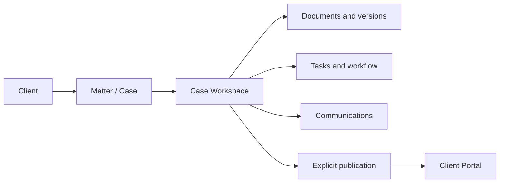
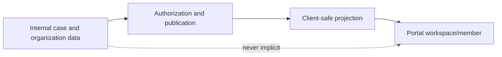
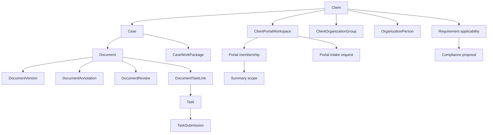
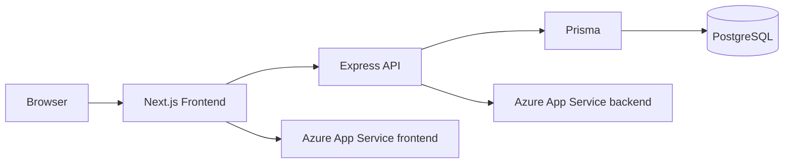
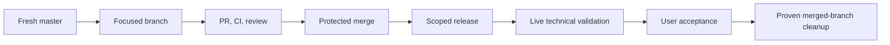

# Adminiculum

Adminiculum is a legal operations platform for law firms. It keeps the client,
matter, and operational work around legal work connected: intake, routing,
missing information, responsibilities, deadlines, documents, review,
communication, publication, and organizational context.

It supports lawyers; it does not practise law autonomously or replace legal
judgment. Lawyers remain responsible for strategy, drafting, negotiation,
advice, approvals, and consequential decisions.

The repository contains `Frontend/` (Next.js App Router) and `Backend/`
(Express, TypeScript, Prisma). Development defaults are frontend port `3000`
and backend port `3001`. No `LICENSE` file is present; public visibility is not
a reuse license.

## Product vision

Adminiculum is being built as a legal operating system: the operational layer
around legal work should make context, ownership, missing information, risk,
next action, and decision required visible without displacing professional
responsibility.

The central UX principle is **complexity in the background, clarity in the
foreground**. Screens should be clean, low-noise, hierarchical, and
task-oriented. Compliance, workflow, and legal-operations machinery should
usually appear as context, status, risk, next action, or decision required.

## Product principles

- Preserve legal context and the relationship between a client, matter,
  document, decision, and history.
- Keep one canonical source of truth instead of parallel shadow models.
- Operate from the client and tenant boundary outward.
- Keep internal data and client-safe publication explicitly separate.
- Preserve traceability, human authority, and least exposure.
- Word remains the primary document editor where that contract is current;
  Adminiculum is not intended to become a weak browser Word clone.

## Platform map



Organizational clients add groups, people, responsibilities, corporate
operation, growth context, and compliance views. Internal structures are not
automatically client-visible.

### Canonical terminology

The repository uses these terms deliberately:

- **Client** is the legal relationship and tenant-scoped business context.
- **Client Dossier** is the client-level operational overview.
- **Client Control Center** is the dossier's module and action surface.
- **Case** and **matter** refer to the legal work record.
- **Case Workspace** is the operational matter surface.
- **Document** is the document record; **DocumentVersion** is a retained file
  version and its metadata.
- **Client Portal** is the explicit external workspace and publication boundary.
- **Organization Group** is a canonical organizational unit.
- **Organization Person** is an internal directory and responsibility record.
- **Responsibility** describes a typed organizational or operational role.
- **Task** is assigned operational work; **Workflow** coordinates selected
  transitions and dependencies.
- **Publication** is an explicit client-facing release of safe material.
- **Grow with us** is the organization-facing progression context.
- **Compliance** is the current findings/proposals/next-step context.
- **Work Package** and **Case Type** describe workflow foundations where the
  current module supports them.

The Hungarian UI label `ügyátvezető` should be preserved when it is the
canonical label for a workflow role; translations should explain rather than
silently rename the domain concept.

## Client management and the dossier

Client management is live. The application provides a client list, client-
scoped navigation, profile/context data, client colors and identity, related
cases, documents, communications, house style, and operational actions.

The Client Dossier is the client-level overview. Its Client Control Center
currently exposes:

1. Open cases (`Nyitott ügyek`), with a numeric KPI only when the case set is
   complete and authoritative.
2. Communications (`Kommunikációk`).
3. Client Portal (`Ügyfélportál`).
4. Organization (`Szervezeti felépítés`) for active organization capability.
5. Grow with us for active organization capability.
6. Compliance for active organization capability.

The dossier also preserves the hero context and `Új ügy`/`Haladó` actions,
Quick Actions, House Style, connected cases, documents, and communications.
The organization area is a compact `ClientOrganizationPreview`; the full
workspace remains at `/clients/[clientId]/szervezet`. Modules deep-link into
canonical detailed workspaces instead of duplicating their control surfaces.

Individual, `ORGANIZATION`, and `CASE_RELAY` modes are distinguished only where
the active contracts support that distinction.

## Cases and Case Workspace

A Case (or matter) is the legal work record. Current routes and services support
case lists, client-scoped cases, status, ownership/responsibility, detail and
workspace context, related documents, communications, tasks, deadlines, and
attention/action views where the module applies.

The Case Workspace composes those canonical services. It is not a second case
database. Its sections vary with case state, but the current architecture links
the case to documents and versions, tasks and workflow, responsibility,
communications, and explicit client publication. Work Package and Case Type
foundations exist for selected flows; a general builder remains evolving
direction rather than a universal current feature.

## Documents and Document Workspace

Documents have metadata and `DocumentVersion` history. The canonical document
record has a direct case association where applicable, while task association is
represented by the audited `DocumentTaskLink` join record. Organization-person
associations use `OrganizationPersonDocumentLink`. These are deliberate,
separate relationships; this README does not claim an unrestricted generic link
to every legal object. Review transitions, structured comparison, annotations,
security classification, and delivery are implemented in parts of the current
system.

The document workspace is for viewing, version context, comparison where
implemented, review, decisions, approvals, delivery, and explanation or
publication. Word remains the primary editing environment where that contract
is current. Do not describe Adminiculum as a browser-based Word replacement.

## Communications

Communications support client and matter association, scoped lists and filters,
pagination, and dossier summaries. Internal and external visibility are
separate concerns. The repository contains provider fields and Outlook-related
work, but Outlook production integration must not be claimed unless an active
route and deployment contract prove it.

## Client Portal

The portal is an explicit external boundary. Current concepts include portal
workspaces, portal identities, invitations, memberships, membership requests,
organization membership, client requests/intake, publications, matter
publication, and safe summary projections.



An `OrganizationPerson` is not automatically a portal identity. An internal
contact email does not create membership. Individual, organization, and
`CASE_RELAY` portal modes are supported where their current contracts apply.

## Organizational clients

Organizations need more than a contact record. `ClientOrganizationGroup` is
the canonical unit model and `OrganizationPerson` is the internal directory
record. Current relationships include `parentGroupId`, `organizationGroupId`,
`managerPersonId`, and `deputyPersonId`. Services enforce same-client links,
self-link prevention, hierarchy-cycle prevention, portal-membership isolation,
responsibilities, and owner links.

People can own contracts, obligations, and development initiatives. Responsibility
gaps identify selected unowned or inactive-owner situations. HR-confidential
document links have a separate role gate.

### Organization workspace

The current `/clients/[clientId]/szervezet` workspace supports hierarchy,
people, person detail, responsibilities, manager/deputy context, portal-access
concepts, and responsibility gaps. The dossier preview is intentionally
compact and does not create a second hierarchy.

### In development: visual Organization Editor

The product direction includes executive hierarchy, units, employee cards,
editable structure, person contact information, moving people and units, and
later drag/drop. This visual redesign is not claimed as live current UI. The
data/API foundation and the visual editor are separate slices.

## Grow with us and Compliance

Grow with us is an organization-facing entry point into corporate operation and
next steps. In the current dashboard it is a navigation card; demo fixture
values such as `DEMO_KFT_COMPANY_EMPLOYEE_COUNT` are not generic production
intelligence.

Compliance views expose relevant areas, findings, proposals, and operational
next-step context where implemented. This is not a claim of autonomous legal
or regulatory advice. Future rule evaluation and richer evidence workflows are
possible direction. The removed Tax Engine is not an active roadmap item.

## Responsibilities, tasks, workflows, and agenda

Responsibilities are typed organization-person assignments. Ownership links
connect people to contracts, obligations, and initiatives. Tasks support
assignments, statuses, deadlines, lifecycle transitions, review/submission
concepts, and case/document links where applicable. Workflow templates and
instances exist for selected flows. Attention logic surfaces work requiring
action.

Agenda and deadline convergence exists for case operations. Do not describe the
repository as a complete shared team-calendar or event-creation product merely
because date fields exist.

## AI, anonymization, and privacy

The repository contains prompt handoff, anonymization, document-analysis,
AI-cache/read-model, and structured-assistance foundations in selected modules.
These are assistive capabilities. They do not publish legal conclusions without
human control.

Privacy relies on authenticated internal actors, tenant/client scoping,
customer-safe projections, explicit publication, portal boundaries, and
confidential-document handling. Internal users and portal identities are
different security concepts.

## Time, billing, reporting, and search

Time attribution, timesheet, and reporting foundations exist and are evolving.
Do not claim production-complete automatic billing or invoicing without an
active route, service, and release contract. Operational navigation supports
client, case, status, workspace, communication, and pagination filters within
the authorized domain.

## Detailed operating inventory

This section explains the current operational surface in more concrete terms.
It describes code on canonical `master` at the time of this README update. A
route, schema model, or UI entry point establishes an implementation boundary;
it does not by itself imply that every deployment has enabled every optional
integration.

### Client management and dossier navigation

The client is the practical starting point for recurring legal work. The client
list leads to a client-specific dossier and client-specific routes for cases,
portal, organization, corporate operation, and workgroups. The dossier reduces
the need to reconstruct a relationship from unrelated global lists: it brings
together identity and visual context, connected cases, documents,
communications, house style, quick actions, and the Control Center cards.
Those cards are navigation and status surfaces; they should lead to the
canonical detailed workspace rather than becoming copies with their own state.

The dossier's organization preview is intentionally a preview. It can show
whether the organization capability is relevant and direct a user to the
organization workspace, but the authoritative hierarchy and responsibility work
lives at `/clients/[clientId]/szervezet`. Likewise, a Portal card is a path to
the explicit external boundary, not evidence that all material for that client
is already visible externally. The distinction matters when a client has both
internal operational records and selected client-safe publications.

### Cases and the Case Workspace

A case is a durable legal-work record with a unique case number, title, client,
status, assigned lawyer, collaborators, external participants, dates, and
operational context. The case model keeps external participants separate from
the internal team: a participant has an explicit role and, where relevant, an
adversarial side; a collaborator is an internal operational teammate. Intake
deadlines also preserve their kind so a statutory or procedural deadline is not
flattened into an undifferentiated personal target.

The case route family provides more than a detail screen. It includes case
lists, attention views, a workspace projection, timeline, workflow and
workflow-history views, responsibility, activity, deadlines, lifecycle,
documents, work items, and case-specific communications. Case access checks
protect these read models. The workspace therefore composes canonical records
instead of duplicating them: a change in a document, task, communication, or
case responsibility remains owned by that module while the case workspace
provides the operational context in which it is read.

The workspace is designed for questions that arise during work: what is this
matter, who owns the next action, what is due, what activity has occurred,
which documents and communications are related, and what workflow state needs
attention. Its mini-dashboard projection and its deeper routes deliberately
coexist. The compact projection supports orientation; detailed screens support
work without inventing a second source of truth. Availability of a particular
section can vary by case state and authorization.

Case Type definitions and Work Package models provide structured foundations.
A Work Package template can hold ordered items; a Case Work Package is the
case-scoped instance and its items retain operational state. Workflow templates
also have draft, version, duplicate, activate, and archive operations. This is
evidence of managed workflow configuration for selected flows. It is not a
claim that every matter type has a completed visual builder or that every team
has adopted the same workflow.

### Document architecture and workspace

The document system separates the document record from its retained versions.
`DocumentVersion` carries version sequencing and version-specific metadata, so
a review or annotation can be tied to a known version rather than an ambiguous
file name. `DocumentTaskLink` records document-to-task association with actor
and time information and prevents duplicate links at the database level.
Organization-person links are separately modeled, which avoids silently
treating a people directory as a generic document permission system.

The current document routes include review submission and saving a workspace
version without overwriting the original document. Review data contains review,
round, and suggestion records. Annotation routes support reading, updating,
resolving, reopening, and commenting, with separate read and manage checks.
Document comparison is represented by comparison records and change segments.
Together these provide traceable review and comparison foundations; they do not
turn the application into a complete browser-native replacement for Word.

The document workspace should be understood as a legal-operations layer around
the primary editor. It can preserve context, lifecycle, versions, review
decisions, annotations, comparisons, task linkage, case association, delivery,
and publication decisions. A lawyer may still open and edit an authoritative
Word document in Word. When the repository offers an in-browser document route
or editor experiment, that is not a promise of feature parity with desktop
Word, nor a reason to misrepresent where final professional editing occurs.

Upload security and client publication are separate steps. A portal intake
attachment is not automatically an accepted `Document`: the data model records
that accepted use requires a clean scan and explicit workforce triage, and it
does not expose a raw storage path. Similarly, an internal document does not
become portal content merely because it belongs to a portal-enabled client.

### Communications and the Outlook boundary

Communications have their own record and attachment metadata. The module
supports scoped lists and pagination, client summaries, linking a communication
to a case or task, creating a task or deadline from a communication where the
service permits it, and explicit client linkage. These associations help the
case workspace and dossier explain operational context without making every
message public or inferring a relationship without user action.

Outlook support is implemented with a deliberately narrow deployment contract.
`GET /communications/outlook/status` reports availability in safe terms. The
dry-run and import endpoints are behind `ENABLE_OUTLOOK_IMPORT`, which is
default-off. The dry-run accepts a provider-shaped payload, normalizes it, and
performs read-only duplicate detection; it does not connect to Microsoft Graph,
read a real mailbox, or write communications. The import path deduplicates by
external message ID and stores attachment metadata, not attachment binaries.

The separate live inbound sync endpoint exists, but it is not universally
enabled. It requires the same feature gate plus a configured
server-controlled workforce mailbox and app-only Graph credentials. Its service
reads a bounded recent inbound window, imports idempotently, applies safe thread
linkage, and returns safe counts instead of provider payloads or tokens. This
is a workforce integration boundary, not a client-portal mail service and not
an assertion that every production environment currently syncs Outlook.

### Client Portal and external publication

The Client Portal is modeled as a separate external workspace. A portal
identity, workspace membership, invitation, membership request, and grant are
different records with different purposes. `ClientPortalWorkspaceMembership`
connects an identity to a workspace; a portal event records workspace activity.
The separation prevents an internal user, a client contact, or an organization
person from becoming a portal member by implication.

Portal summary scopes intentionally provide content-free aggregate visibility.
They do not create a case grant and do not imply access to messages or
documents. A client intake request likewise does not create a Case, grant, or
publication when submitted: workforce triage decides whether and how it enters
internal operations. Intake attachment handling adds a scan and acceptance
boundary before material can be accepted as a document.

Publication is explicit. Client publication records and publication events can
track an outward-facing item and its lifecycle, while internal case,
communication, organization, and document records retain their own access
rules. The portal route family includes registration, login, onboarding,
verification and password-reset flows; client-safe requests, documents, matter
views, contracts, organization overview, messages, and to-do routes; and an
internal portal-administration surface. Route presence still does not mean an
internal object is automatically published: visibility must be granted through
the applicable portal and publication contracts.

### Organization, responsibility, Grow, and compliance

For organizational clients, groups and people are first-class operational
models. A group can have a parent group, while a person can belong to a group
and have manager and deputy relationships. Services enforce same-client links,
reject self-links, prevent hierarchy cycles, and keep portal membership
isolated from internal organization records. Typed responsibilities attach to
people; ownership links cover selected contracts, obligations, and development
initiatives. Responsibility-gap views identify selected situations where an
owner is missing or inactive.

The current organization workspace supports hierarchy, people, person detail,
responsibilities, manager/deputy context, access concepts, and gaps. Protected
HR-confidential document links have their own role gate. It should not be
described as a universal HR information system. In particular, the richer visual
Organization Editor described by open PR #174 is **in development**: executive
hierarchy editing, person contact editing, moving units or people, and later
drag-and-drop are not represented here as live `master` behavior.

Grow with us is a current organization-facing entry point into corporate
operation and next-step context. It should be read as navigation and
operational framing, not as automatic business advice. Compliance has more
substantial foundations: requirements have version and citation records;
applicability captures a client-specific evaluation with rule version, evidence
digest, reference period, source-support state, specialist requirement, and an
explicit outcome such as applies, does not apply, insufficient facts, or legal
review required. Compliance proposals can be connected to that context. These
models preserve why a result needs review; they do not authorize autonomous
regulatory conclusions. The retired Tax Engine is not an active roadmap item.

### Tasks, workflows, deadlines, and agenda

Tasks are operational records with a lifecycle, assignment history, task
submissions, review decisions, linked submission documents, and linked time
entries. The task API offers list and case-task views, a review queue, creation
and updates, start, submit, complete, block, unblock, reschedule, reassign,
recommendation, my-task, and auto-generation operations. The appropriate
authorization and workflow rules decide whether an actor can perform each
transition. This is stronger than a checklist: it records how work moved, who
was assigned, and what review material was supplied.

Task submission and review routes expose an eligible-reviewer view and a
submission-review detail. Case workflows can be observed through case workflow,
graph, history, and summary routes. Templates can be administered and versioned
as described above. Dependencies and managed transitions make attention views
useful, but they do not promise a universal no-code workflow platform.

Agenda and deadlines converge operational dates that already belong to cases,
tasks, and related work. Current routes include `/calendar` and `/deadlines`,
and case endpoints expose deadline data. This is useful planning support. It is
not documented as a full shared-calendar product with arbitrary event creation,
meeting invitations, resource booking, or replacement for a dedicated calendar
service.

### AI assistance, anonymization, time, billing, and reporting

AI-adjacent capabilities are constrained assistance. The prompt module exposes
template, case-preparation, draft, import, verification, approval, return, and
rejection flows. That sequence makes human verification and decision points
visible. Anonymization and anonymize modules, document-analysis foundations,
and AI-oriented read models exist in the repository, but no README claim should
imply that data is automatically safe to disclose or that an AI system gives
binding legal advice. A responsible workflow retains human review before use,
sharing, or publication.

Time entries, presets, report instances, report artifacts, time attribution,
and timesheet-report routes exist. Presets can be listed and resolved; report
persistence mutations are guarded by a timesheet persistence foundation. This
supports time capture and report preparation in implemented and evolving
areas. It is not evidence of production-complete billing, invoice issuance,
payment collection, tax calculation, or automatic client charging. Those
outcomes require separate commercial, tax, and release contracts.

### Security, tenancy, and data model map

Security begins with authentication but is carried through domain boundaries.
Internal users, portal identities, portal memberships, client scope, case read
access, document read/manage checks, organization-specific role gates, upload
scan state, and explicit publication are distinct controls. Safe error and
status responses avoid exposing mailbox internals, tenant IDs, access tokens,
or raw provider payloads. Client-safe projections are outputs created under a
contract; they are not a view over every internal column.

The following map summarizes the major persistent relationships:



This map is intentionally a relationship map, not an access grant map. A line
shows a modeled association or operational context; it does not mean every
actor traversing one record can read the next. The system uses the client and
portal boundaries, explicit publication, and module-level authorization to
decide that question. Reviewers should verify each visible feature against the
current route, service, database schema migration, and applicable authorization check
before treating a documentation summary as a formal release acceptance record.

## Authentication and authorization

The frontend uses authenticated application providers. The backend uses
authenticated internal actors, role checks, service-level authorization, and
client-scoped access checks. Portal identities and memberships are distinct
from internal users. This README intentionally publishes no secrets, tokens,
tenant IDs, or exploitable operational detail.

## Data model overview

- Core legal operations: `Client`, `Case`, users, matter status and ownership.
- Client operations: profile, colors, house style, workspace context.
- Documents: `Document`, `DocumentVersion`, review, comparison, annotations,
  classifications, and work-context links.
- Portal/publication: workspace, identity, membership, invitations, requests,
  publications, and safe projections.
- Organization: `ClientOrganizationGroup`, `OrganizationPerson`,
  responsibilities, manager/deputy relationships, and ownership.
- Workflow/tasks: task lifecycle, workflow templates/instances, submissions,
  attention, deadlines, and work-package context.
- Compliance, communications, security, and audit: findings/proposals,
  communication records, authorization, upload security, and migration history.

## Frontend and backend architecture

`Frontend/` is a Next.js App Router, React, and TypeScript application. Routes
live under `src/app/`, shared UI under `src/components/`, and typed API
wrappers under `src/lib/`. `Frontend/tests/` contains structural and behavioral
contracts.

`Backend/` is an Express and TypeScript API. Domain modules under
`src/modules/` separate routes, authorization, services, DTOs, and projections.
Prisma owns the PostgreSQL client and schema. Versioned migrations live under
`Backend/prisma/migrations/`.



## Repository structure and stack

```text
Adminiculum/
├── Frontend/                 # Next.js application and tests
├── Backend/                  # Express API, Prisma, migrations, tests
├── .github/workflows/        # CI, recovery, migration, deployment gates
├── docs/                     # Product, architecture, review, runbooks
├── scripts/                  # Development and verification helpers
└── README.md
```

- Frontend: Next.js `^15.5.20`, React `19.2.1`, TypeScript `^5.8.2`.
- Backend: Express `^4.21.0`, TypeScript `^5.9.3`.
- Database/ORM: PostgreSQL, Prisma `^5.22.0`.
- Runtime: Node.js 20 (`>=20 <21`).
- Tests: Node/tsx, Jest, PostgreSQL integration, and Playwright QA where defined.
- Production: Azure App Service.

## Development setup

Use Node.js 20, npm, and PostgreSQL for database-backed tests. Install each
project independently:

```powershell
cd Backend
npm install
npm run prisma:generate
cd ../Frontend
npm install
```

Use safe local `.env.example` templates and uncommitted local configuration.
Never commit real `.env` files, credentials, tokens, or connection strings.

```powershell
# terminal 1
cd Backend
npm run dev

# terminal 2
cd Frontend
npm run dev
```

Useful checks are `npm test` and `npm run build` from `Frontend/`, and `npm
test`, `npm run build`, `npm run db:status`, and `npm run
db:migrations:verify-replay` from `Backend/`. `db:bootstrap` is for local
bootstrap; production schema changes use versioned migrations only.

## Testing and quality gates

CI applies frontend and backend typecheck/build gates, frontend and backend
preflight, PostgreSQL integration, migration replay and WebJob tests, security
and safe-error recovery, upgrade safety, Docker validation, and deployment
contract checks. Review the exact commit and applicable workflow; do not rely
only on a reported test count.

The most useful review questions are: does the test exercise the real service
or only a string contract, is the client boundary tested, does a failure remain
truthful to the user, and is the release scope smaller than the implementation
surface? Database-backed suites may be skipped when their PostgreSQL contract
is unavailable; that is different from passing the integration behavior.

## Database migrations

Prisma migrations are ordered, versioned history. They must be replayable on an
empty schema and applied by the canonical `adminiculum-db-migrate` mechanism.
Do not rewrite migration history, reset production, run ad-hoc SQL, or use
`prisma db push` in production. Migration sequencing is being hardened in open
development work; this README documents canonical `master`, not speculative
open-PR behavior.

## Deployment

Production uses Azure App Service:

- Backend: `adminiculumbackend-b1-01`.
- Frontend: `adminiculumfrontend-austriaeast-01`.

Production deployment is manual. The workflow resolves `master` to one
immutable commit, builds the backend runtime and Next standalone artifacts,
then checks health and release identity. Component scope must be explicit.
Never treat a deployment job alone as proof of the running product SHA.

The frontend is deployed as a Next standalone package. The backend is deployed
as a prebuilt Node runtime artifact. Public release-identity endpoints and
health endpoints are technical evidence; authenticated UI acceptance is still
separate. A frontend-only release must not be described as a backend release,
and a migration must not be described as successful merely because a workflow
was dispatched.

## Branch and PR workflow



Use a short-lived focused branch. A targeted repair is not a rewrite. Retain
branches until acceptance and recovery value have ended.

## Bugfix protocol and contributor guardrails

Identify the live defect, reproduce it, find its root cause and owning layer,
define the smallest fix, inventory affected working capabilities, implement,
run focused tests and CI, review migration/release scope, validate live
technical behavior, and complete user acceptance. Separate functional repair
from refactoring.

PRESERVE-FIRST applies to code, data, and docs. Do not delete legacy code only
because it is old. Do not perform destructive cleanup during a bugfix. Keep
tenant isolation, explicit publication, canonical models, and human authority.
Live user acceptance is final authority for visible behavior.

## Production status versus roadmap

The labels below are deliberately conservative. **Live** means the canonical
application contains an active current surface. **Implemented / evolving** means
there are routes, services, and/or persistent models that support the stated
work, while rollout, configuration, breadth, or UX may still vary. **In
development** identifies open work that is not described as current `master`
behavior. **Planned / evolving** identifies direction or foundation without a
claim of a complete general-purpose product.

| Area | Status | Current, bounded statement |
|---|---|---|
| Client management | LIVE | Client list, dossier, client scope, identity, colors, connected records, and client-specific navigation are current. |
| Client Control Center | LIVE | Cards, conditional KPIs, quick actions, house style, and deep links provide orientation without replacing detailed workspaces. |
| Cases | LIVE / EVOLVING | Case lists, client cases, status, assigned lawyer, collaborators, participants, attention, and operational read models exist. |
| Case Workspace | IMPLEMENTED / EVOLVING | Workspace, timeline, workflow, responsibility, activity, deadline, lifecycle, document, and work-item views compose canonical case context. |
| Case Type and Work Package | IMPLEMENTED / EVOLVING | Type definitions, templates, case packages, and ordered package items exist; a universal visual builder is not claimed. |
| Documents | IMPLEMENTED / EVOLVING | Document records, retained versions, direct case association, task-link joins, and organization-person links are modeled separately. |
| Document Workspace | IMPLEMENTED / EVOLVING | Review submission, workspace versions, annotations, comments, comparison records, and review foundations support operations around the primary editor. |
| Word editing | CURRENT PRINCIPLE | Word remains the primary editor where that contract applies; browser feature parity and a browser Word clone are not product claims. |
| Communications | IMPLEMENTED / EVOLVING | Scoped lists, pagination, client summaries, explicit case/task/client links, and task/deadline extraction operations exist. |
| Outlook dry run/import | GATED | The default-off `ENABLE_OUTLOOK_IMPORT` gate controls provider-shaped dry run and import behavior; dry run never reads Graph or writes records. |
| Outlook live inbound sync | GATED / CONFIGURED | The endpoint exists only for a configured server-controlled mailbox with app-only Graph credentials; it is not claimed enabled in every environment. |
| Client Portal | IMPLEMENTED / EVOLVING | Identity, workspace, membership, invitation, request, intake, publication, and safe-summary models form an explicit external boundary. |
| Portal visibility | CURRENT CONTROL | Publication and grants are explicit; summary scope is aggregate-only and does not grant case, message, or document access. |
| Organization | IMPLEMENTED / EVOLVING | Groups, people, hierarchy, manager/deputy links, typed responsibilities, ownership, and gap views are current foundations. |
| Visual Organization Editor | IN DEVELOPMENT | Open PR #174 contains a richer editor direction; it is not represented as merged live behavior in this README. |
| Grow with us | IMPLEMENTED / EVOLVING | It is an organization-facing corporate-operation and next-step entry point, not automated business advice. |
| Compliance | IMPLEMENTED / EVOLVING | Requirement versions, citations, applicability snapshots, explicit outcomes, and proposals support traceable operations and review. |
| Tax Engine | NOT ACTIVE ROADMAP | The retired Tax Engine is not described as a current or active planned capability. |
| Responsibilities | IMPLEMENTED / EVOLVING | Typed person responsibilities and selected ownership links make responsibility gaps visible without turning the directory into a generic HR suite. |
| Tasks | IMPLEMENTED / EVOLVING | Assignment, lifecycle, blocking, rescheduling, reassignment, submissions, reviewer selection, review decisions, and linked time data are represented. |
| Workflows | IMPLEMENTED / EVOLVING | Versionable templates and case workflow graph/history/summary routes exist for selected flows; a universal no-code platform is not claimed. |
| Calendar and agenda | IMPLEMENTED / EVOLVING | Calendar, deadline, and case-deadline support converge operational dates; arbitrary shared-event and resource-booking claims are excluded. |
| AI assistance | IMPLEMENTED / EVOLVING | Prompt templates, case preparation, drafts, import, verification, approval, return, and rejection enable human-controlled assistance. |
| Anonymization | IMPLEMENTED / EVOLVING | Anonymization modules and related foundations exist; users still need a human disclosure and legal-review decision. |
| Time attribution | IMPLEMENTED / EVOLVING | Time entries and task-submission time links provide current operational foundations. |
| Timesheet reporting | IMPLEMENTED / EVOLVING | Presets, report instances, artifacts, resolution, and guarded persistence mutations exist. |
| Billing and invoicing | PLANNED / EVOLVING | Automatic invoicing, collection, tax calculation, and charging are not claimed production-complete. |
| Deployment sequencing hardening | IN DEVELOPMENT | Open PR #175 proposes migration-before-backend release ordering; this README describes master rather than treating the proposed sequence as released. |

## What Adminiculum is not

Adminiculum is not a browser Word clone, an autonomous lawyer, a generic CRM
with legal labels, a client-visible dump of internal information, or an AI
system that publishes legal conclusions without human control.

## License, ownership, and confidentiality

No `LICENSE` file is present. Do not infer permission to reuse code, branding,
templates, client data, or deployment configuration from repository visibility.
