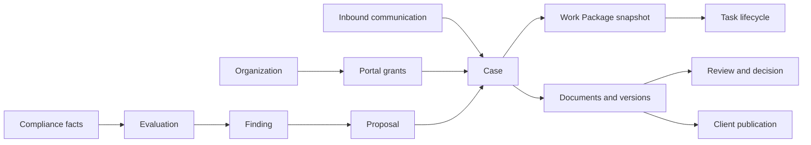

# Product knowledge graph

The machine-readable graph is under `graph/`. Nodes and edges are intentionally evidence-oriented: each row contains a source SHA or canonical file reference. Mermaid files are views over selected graph paths, not independent claims.

## Graph interpretation

- A capability can have multiple implementations and states.
- `IMPLEMENTS` means source evidence maps an artifact to a capability.
- `CALLS`/`ROUTES_TO`/`AUTHORIZED_BY` represent connectivity only where source reads establish the link.
- `HISTORICAL_BETTER_THAN` is a product judgment, not a runtime claim.
- `ORPHANED_FROM` means the artifact exists but no current consumer was found in the audited tree.

## Required graph files

`nodes.csv`, `edges.csv`, `capabilities.json`, `ui_surfaces.csv`, `routes.csv`, and `recovery_candidates.csv` are committed beside this document.

## Core cut graph

