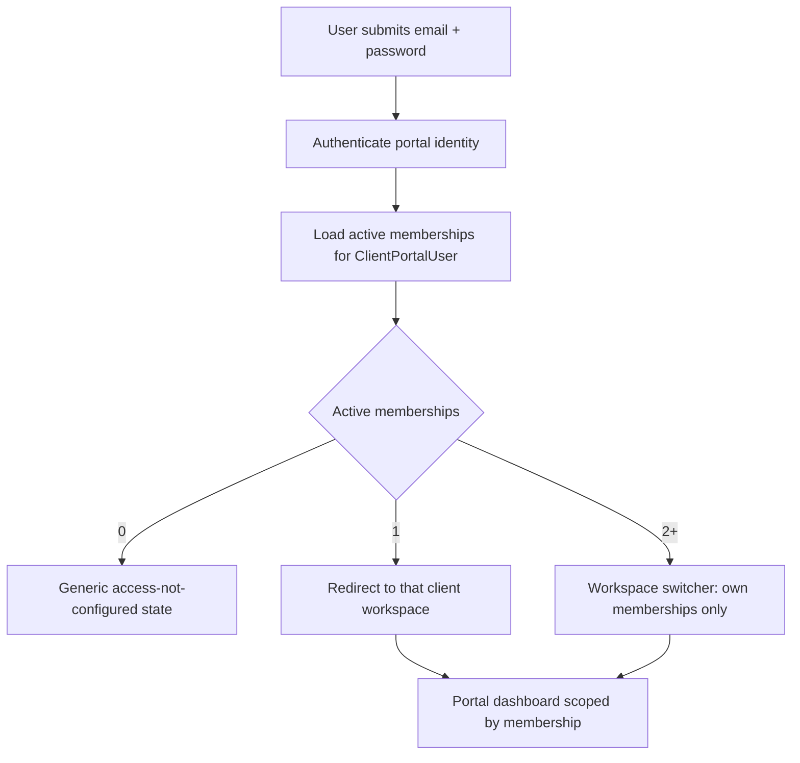

# Client Portal Tenant Isolation, Login Flow, and UI Source Alignment

Classification target: `client_portal_tenant_isolation_login_ui_alignment_documented_no_runtime_change_no_schema_change_no_db_change`

This is a docs-only product/security alignment note. It does not edit `Backend/prisma/schema.prisma`, create migrations, add API routes, add frontend UI, change auth, enable the client portal, connect to a database, connect to Azure/production, deploy, copy UI assets into this repo, or change runtime behavior.

## 1. Executive summary

The 2nd-level Client Portal / Megbízói munkatér must be tenant-isolated by design: a client portal user must never see the law firm's other clients, a global client list, or any signal that an unauthorized client, case, document, request, report, team, requester, connector, or workspace exists.

The login experience should be simple and non-enumerating:

1. The user enters email and password.
2. The backend resolves the authenticated `ClientPortalUser` and active `ClientPortalMembership` records.
3. The user lands directly in their own client/workspace scope if exactly one membership exists.
4. If multiple active memberships exist, the user may switch only among those memberships.
5. If no active membership exists, the UI shows a generic access-not-configured state without revealing any client names.

Email domain alone must never grant access. Client Portal visibility must be derived from authenticated portal identity, explicit membership, role, team/workgroup scope, and explicit grants or publications.

## 2. Current issue being locked down

Current Client Portal work remains planning-only and gated:

- Client Portal is future-only / disabled.
- CP-SCHEMA-1 remains blocked by Prisma baseline/proof work.
- CONNECTOR-SCHEMA-1 also remains blocked until baseline/proof is resolved.
- Existing docs already require a separate portal identity and authorization boundary.
- Existing UI source materials include multi-client-looking demo labels such as Alfa Kft. and Delta Kft.; these may guide internal design and demo states, but must not imply that one real portal user sees unrelated clients in one session.

This note locks the product/security rule: the portal is not a client directory. It is a membership-scoped workspace.

## 3. Tenant isolation principle

A client portal user must not see:

- other clients;
- a client list or client search;
- client IDs of other clients;
- other clients' teams, departments, requesters, or admins;
- other clients' matters, cases, requests, documents, messages, communications, connectors, reports, or monthly summaries;
- the existence of an unauthorized case, document, request, connector queue, report, team, or workspace;
- cross-client benchmarks unless explicitly approved later and truly anonymized.

Client Portal authorization must be derived from:

- authenticated `ClientPortalUser`;
- active `ClientPortalMembership`;
- `clientId` membership scope;
- optional `teamId`, workgroup, department, or request scope;
- portal role;
- explicit case/document/message/report/request grants;
- explicit publication/approval state for client-visible artifacts.

Hard rules:

- Email domain matching is not access control.
- Existing internal `UserRole.CLIENT` is not sufficient for portal access.
- Internal Adminiculum users and connector actors must not automatically become client portal actors.
- Missing, inactive, suspended, expired, or revoked memberships fail closed.
- Every portal read must be filtered by session membership before resource lookup details are returned.

## 4. Login and membership resolution flow

### Public login page

The public login page should include:

- Adminiculum / law-firm-approved brand;
- email;
- password;
- optional forgot-password link;
- optional invitation acceptance entry point.

The public login page must not include:

- a client selector;
- a company selector;
- a global client directory;
- demo client cards;
- public organization lookup;
- partner/client logos that reveal live client relationships unless separately approved for marketing.

### After authentication

Membership resolution should run after successful authentication:

Workspace switcher rules:

- show only memberships belonging to the authenticated user;
- do not show all clients;
- do not support free-text global client search;
- do not reveal inactive or unauthorized memberships unless the user owns that membership and the state is safe to show;
- switching workspace must re-scope every query, route, connector badge, report, request, document, and message.

## 5. Registration/invitation model

Preferred model:

- invitation-only client portal user creation;
- internal Adminiculum user or authorized client admin invites the user;
- invite ties email to client, optional team/workgroup, and role;
- user sets password through the invite;
- invite acceptance creates or activates `ClientPortalUser` and `ClientPortalMembership` only for the invited scope;
- every invite action is audited.

Avoid in MVP:

- open public registration;
- domain-based auto-join;
- enter-company-name lookup;
- showing whether a company already is an Adminiculum client;
- automatic role upgrades from email domain, external workflow role, or connector user identity.

If self-registration is later allowed:

- create a pending access request only;
- grant no data access until approved;
- use a generic confirmation response;
- do not disclose whether the company, email, or domain already exists;
- require internal or client-admin approval before any membership becomes active.

## 6. Non-enumeration rules

Login:

- invalid email and invalid password must return the same generic error;
- inactive, suspended, expired, or unconfirmed accounts must not reveal which condition applies on the public login surface.

Forgot password:

- always show a generic message such as: if this email exists and is eligible, instructions have been sent;
- do not reveal whether the email belongs to a portal user, internal user, or no user.

Invite acceptance:

- invalid, expired, revoked, or already-used invite tokens should show a generic safe error;
- support a trusted support path without revealing client details publicly.

Resource access:

- unauthorized and non-existent resource responses should be indistinguishable from the client user's perspective;
- prefer generic 404/not-found style responses for resource-level denials;
- log the denial internally with safe redaction.

Workspace selection:

- show only the user's own active memberships;
- no global search;
- no autocomplete across all clients;
- no leaked IDs or names for unauthorized clients.

## 7. API design implications

Prefer session-scoped Client Portal endpoints:

- `GET /api/v1/client-portal/me/summary`
- `GET /api/v1/client-portal/me/requests`
- `GET /api/v1/client-portal/me/documents`
- `GET /api/v1/client-portal/me/messages`
- `GET /api/v1/client-portal/me/report`
- `GET /api/v1/client-portal/me/workspaces`

Avoid public clientId-driven Client Portal endpoints:

- `/api/v1/client-portal/summary/{clientId}`
- `/api/v1/client-portal/departments/{clientId}`
- `/api/v1/client-portal/clients/{clientId}/...`

If a route later contains `clientId`, `workspaceId`, `caseId`, `documentId`, `requestId`, `messageId`, or connector object IDs, the backend must:

- validate the route parameter against the authenticated portal session and active membership;
- never trust the route parameter as proof of scope;
- avoid returning different response shapes for unauthorized vs missing resources;
- return only portal DTOs, never internal Adminiculum models directly;
- apply explicit publication/grant checks for documents, messages, reports, and case/request details.

Recommended future implementation posture:

- Client Portal routes stay under `/api/v1/client-portal/...`.
- Portal middleware resolves `portalUserId`, `membershipId`, `clientId`, role, and team/workgroup scope before handlers run.
- Handlers query through membership-aware service functions, not generic internal service functions.
- DTO mappers remove internal notes, AI drafts, review comments, strategy, billing internals, raw communications, and internal task details.

## 8. UI implications

### Login screen

- Use Adminiculum / approved law firm brand.
- Show email/password and optional forgot-password/invitation entry.
- Do not show client logos, demo client lists, company pickers, or public client search.
- Avoid copy that implies public self-service organization discovery.

### Dashboard

- Show the current organization/workspace name after login.
- Show an organization switcher only if multiple active memberships exist.
- The switcher lists only authorized memberships.
- Do not show a global client directory.
- Do not show cross-client aggregates in MVP.

### Team and permissions page

- Client admin sees only users within their own client/workspace scope.
- Client admin cannot search all Adminiculum users.
- Client admin cannot see other client admins.
- Client admin can invite only into their authorized client/team scope.
- Team membership changes should be audited.

### Monthly report

- Scope reports to the current client/workspace.
- Do not show cross-client benchmarks in MVP.
- Do not expose internal timesheet details unless explicitly approved and transformed into a client-safe report snapshot.
- Do not reveal other clients through comparison, percentile, or benchmark wording.

### Integrations

- Show only integrations configured for the current client/workspace.
- Connector queues are scoped to the current client connection.
- Do not list other clients' connected systems.
- Connector source badges may show the external system and queue for the current client only.
- Outbound connector updates require approval and must never include internal notes, AI drafts, strategy, review comments, raw communication, or internal tasks.

## 9. Role-specific visibility in the 2nd-level workspace

| Role | May see | Must not see |
| --- | --- | --- |
| Requester | Own requests, own documents/messages, tasks or document requests assigned to them | Other teams' requests, other requesters' documents/messages, client-wide reports unless granted |
| Team lead | Own team's requests, team-level document/status views, team requesters | Other teams unless explicitly granted, client-wide admin settings unless also admin |
| Client manager | Client-level monthly summary, department/category aggregates, approved reports | Internal timesheet details, internal review notes, internal legal strategy |
| Client admin | Membership/user management and integration setup within own client scope | Other Adminiculum clients, other client admins, internal Adminiculum users outside invite/search constraints |

Role checks must combine with membership, team/workgroup scope, and resource publication/grant state. Role alone is not enough.

## 10. UI source folder review

Reviewed local source folder:

`C:\Users\hubay\Documents\Ügyfélportál`

Accessible: yes.

Observed files:

| File | Type | Notes |
| --- | --- | --- |
| `Adminiculum Ügyfélportál v1.1.pdf` | PDF | Client portal UI/UX concept source. PDF text extraction was not available in the local Python environment, so review used filenames and HTML exports in the zips. |
| `Adminiculum Ügyfélportál v1.2.pdf` | PDF | Screen-specific / development-prep concept source. Same extraction limitation as above. |
| `# Adminiculum ügyfélportál UIUX.zip` | ZIP export | Contains standalone/versioned HTML exports, design-system folder, support script, and uploaded image assets. |
| `# Adminiculum ügyfélportál UIUX (1).zip` | ZIP export | Newer export including v1.2 HTML variants plus the same kind of design-system/assets structure. |

Relevant ZIP contents observed without copying assets into the repo:

- `Adminiculum Ügyfélportál (standalone).html`
- `Adminiculum Ügyfélportál.dc.html`
- `Adminiculum Ügyfélportál-print-saiopy.dc.html`
- `Adminiculum Ügyfélportál v1.1.dc.html`
- `Adminiculum Ügyfélportál v1.1-print-nmhkze.dc.html`
- `Adminiculum Ügyfélportál v1.2.dc.html`
- `Adminiculum Ügyfélportál v1.2-print-7ihohb.dc.html`
- `_ds/.../README.md`
- `_ds/.../colors_and_type.css`
- `_ds/.../components.css`
- image uploads under `uploads/`

Design guidance captured from HTML snippets:

- The portal is positioned as a calm client-facing status surface, not the internal legal workbench.
- Internal workflow, triage, review, AI drafts, timesheets, and strategy remain hidden.
- Only approved status, document requests, to-dos, messages, and client-friendly responses reach the portal.
- The v1/v1.1/v1.2 concepts include role-based visibility and a team/users administration surface.
- Connector/integration concepts include approved outbound status to Jira/Teams/Bitrix-like systems.

Tenant-isolation adjustments for future UI tasks:

- Treat Alfa Kft. / Delta Kft. as separate demo states or internal mockup examples, not simultaneous unrelated clients visible to one portal user.
- The dashboard greeting may show the current authorized organization, e.g. Alfa Kft., after login.
- Request lists must not mix unrelated client organizations in one real session.
- If a design screen shows multiple company names, future implementers must decide whether those are same-client departments/teams, internal admin mockup data, or separate demo screenshots; they must not ship as a global client list for portal users.
- Team/admin screens must be scoped to current client/workspace membership only.
- Integration screens must show only current-client connectors and selected legal queues.

No binary UI assets were copied into the Adminiculum repo. No files from `C:\Users\hubay\Documents\Ügyfélportál` were staged.

## 11. Security test implications

Future Client Portal implementation should include tests proving:

- a client user cannot call or infer a global clients list;
- a client user cannot access another client's summary by guessed `clientId`;
- a client user cannot access another client's request, case, document, message, report, team, requester, connector, or queue by guessed ID;
- a one-membership user does not see a workspace selector;
- a multi-membership user sees only their own memberships;
- forgot password does not reveal whether an email exists;
- login failure does not reveal whether the email, password, membership, or account state was the failing part;
- invalid invite and expired invite responses are non-enumerating;
- unauthorized resource and missing resource responses are indistinguishable externally;
- client admin cannot invite or search users outside their own client/workspace scope;
- connector source badges do not reveal other clients, other queues, or external systems outside the current membership;
- monthly reports do not reveal cross-client benchmarks or raw internal timesheet details;
- portal DTOs never include internal notes, AI drafts, review comments, strategy, raw communications, internal tasks, or unapproved document/review data.

## 12. Open questions

- Will Client Portal v1 use a password-based portal identity, magic-link/invitation login, external identity provider, or a hybrid flow?
- Should `ClientPortalTeam` be separate from existing `ClientWorkgroup` / `Department`, or can one existing concept safely represent external team scope?
- Which internal role is allowed to invite the first client admin for a client?
- Can a client admin invite all roles, or only lower-scope roles?
- What is the exact non-enumerating response convention for portal 404/403-like cases?
- Should multi-membership users have a persisted default workspace?
- Which UI source screen is canonical for v1.2 once implementation begins: PDF, standalone HTML, or versioned `.dc.html` export?
- How should connector source badges be redacted for requesters vs team leads vs client admins?

## 13. Recommended next prompt

`Adminiculum — CLIENTPORTAL1H tenant-isolated portal API contract docs-only`

Recommended scope for that next prompt:

- define session-scoped `/api/v1/client-portal/me/*` contracts;
- define non-enumerating response conventions;
- define portal DTO boundaries;
- map roles/memberships to query filters;
- keep CP-SCHEMA-1 and CONNECTOR-SCHEMA-1 blocked until baseline/proof work is resolved;
- make no schema, migration, runtime, DB, auth, Azure, frontend UI, or deployment changes.

## 14. Final status

- Runtime change: no.
- Schema/migration change: no.
- DB change: no.
- Auth/client portal runtime change: no.
- External connections/secrets used: no.
- External UI source folder accessible: yes.
- CP-SCHEMA-1 unblocked: no.
- CONNECTOR-SCHEMA-1 unblocked: no.
- Final classification: `client_portal_tenant_isolation_login_ui_alignment_documented_no_runtime_change_no_schema_change_no_db_change`.
