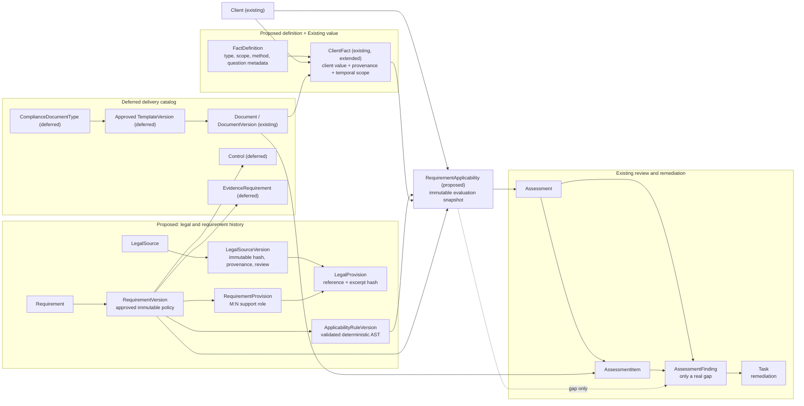

# Phase 6 Conceptual Model

## Status legend

- **Existing** means the canonical Adminiculum model is reused.
- **Proposed** means a Phase 6 schema addition is required before implementation.
- **Deferred** means the concept is real but does not need a minimum Phase 6
  persisted model.

## Relationship rules

1. `LegalSource` is the stable instrument identity. `LegalSourceVersion` is an
   immutable captured/reviewed representation, identified by content hash,
   provenance and capture date. `LegalProvision` always belongs to exactly one
   source version.
2. `Requirement` is stable product identity. `RequirementVersion` is the only
   runtime policy input and has explicit M:N `RequirementProvision` citations;
   it may reference more than one provision and a provision may support more
   than one requirement.
3. A `RequirementVersion` owns one or more ordered `ApplicabilityRuleVersion`
   rows. Their JSON AST is constrained to deterministic operations over declared
   fact definitions; it is never executable source code.
4. `FactDefinition` declares meaning, type, question metadata, valid scope and
   determination method. The existing `ClientFact` remains the client-owned
   value/evidence record, extended to reference the definition and to carry
   typed, scoped and temporal data.
5. `RequirementApplicability` is a point-in-time evaluation of one client and
   one requirement version. It retains the selected rule, fact inputs or their
   immutable snapshot, source support, result, reason, unresolved inputs,
   evaluation timestamp and engine version. Re-running later produces a new row
   rather than altering historic conclusions.
6. An `Assessment` can display or review evaluations. `AssessmentItem` can hold
   user-facing evidence/review state. `AssessmentFinding` is created only after
   a compliance gap is identified and should later link to its applicability
   record. Existing `Task` handles remediation.
7. Existing `DocumentVersion` is evidence or rendered customer output. A future
   `ComplianceDocumentType` and approved template-version catalog classifies
   delivery; it does not replace document/version lineage.

## Temporal and scope semantics

Client fact records need distinct fields for observed time, legal/effective
time, validity range and reference period. The fact definition identifies which
ones are mandatory. Scope is a bounded enum with an optional same-client entity
reference, so a site risk review, a transaction invoice and a company-wide
employee count cannot be accidentally evaluated as equivalent.

Evaluation status is deliberately multi-valued. Missing facts, legal or
technical classification, ambiguous source support, not-yet-effective law and
expired policy are reviewable results, not `false`.
